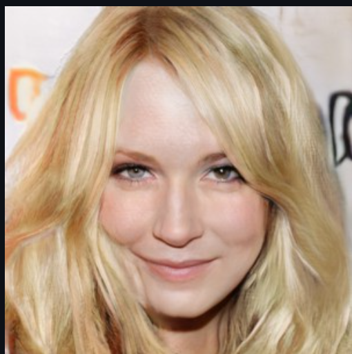

# 🎨 StyleGAN Latent Editor & StyleMixing UI

This project provides a user-friendly UI for latent editing and style mixing using pretrained StyleGAN models like **StyleGAN-FFHQ** and **StyleGAN-CelebA-HQ**.  
It allows interactive editing of facial attributes like **smile**, **age**, **gender**, and **glasses**, and supports **style mixing** between randomly generated faces.

---

## 🧠 Model Architecture: StyleGAN2 Overview

StyleGAN2 is a powerful generative adversarial network architecture that consists of:

### 1. **Mapping Network**
- Transforms latent vector `z ∈ ℝ⁵¹²` into intermediate latent `w ∈ ℝ⁵¹²`
- Removes entanglement for better control
- Typically 8 fully-connected layers

### 2. **Truncation Trick**
- Pulls `w` towards average latent `w_avg`:
- w = w_avg + ψ(w - w_avg)
- Helps improve image quality

### 3. **Synthesis Network (Generator)**
- Starts from a learned constant (4×4×512)
- Each block upsamples and applies:
- Style modulation using `w`
- Per-layer noise injection
- LeakyReLU activation
- Outputs high-resolution image (e.g., 1024×1024)

### 4. **Discriminator**
- Convolutional network that distinguishes real vs fake
- Trained with non-saturating GAN loss + R1 regularization

---

## 🧬 Latent Space Logic

- **Z space**: Original latent input, sampled from normal distribution
- **W space**: Intermediate latent (`w = MLP(z)`) used for style control
- **W+ space**: Layer-wise style vectors (`[1, 18, 512]`) for finer edits

### Latent Editing
- Modifies latent vectors along **predefined boundaries** (e.g., smile, age)
- Each edit uses:
- w_edit = w + α * direction
  where `α` is the slider value from the UI

### Style Mixing
- Combines `coarse`, `middle`, and `fine` layers of two latent vectors
- Coarse (0–3): face shape  
- Middle (4–7): eyes, nose  
- Fine (8–17): color, texture, hair  
- Creates new faces by mixing styles at selected levels

---

## 🖥️ UI Overview

Built with **Streamlit**, the app supports:

### ✅ Features:
- Model selection: `stylegan_celebahq`, `stylegan_ffhq`
- Generate one image and its latent vector
- Attribute sliders:
- Smile 😄
- Age 👴
- Gender 🚻
- Glasses 👓
- Latent editing triggered by a button
- **StyleMixing tab**:
- Generate two random faces (source & target)
- Select layers to mix (coarse/middle/fine)
- Output mixed image

---

## ✨ Sample Results

### 🎯 Latent Editing

| Attribute | Before | After |
|----------|--------|-------|
| Smile    |  |  |
| Age      |  |    |
| Glasses  |  |  |

### 🔀 Style Mixing

| Source | Target | Mixed |
|--------|--------|-------|
|  |  |  |

> Upload your result images into a `results/` folder in your GitHub repo to display them here.

---

## 🚀 Run the App

```bash
streamlit run app.py
```
Make sure you follow setup.md for proper working

## 📝 Credits

* [StyleGAN2 by NVIDIA](https://github.com/NVlabs/stylegan2)
* [InterfaceGAN](https://github.com/shenxz/InterfaceGAN)
* UI built using [Streamlit](https://streamlit.io)

---


